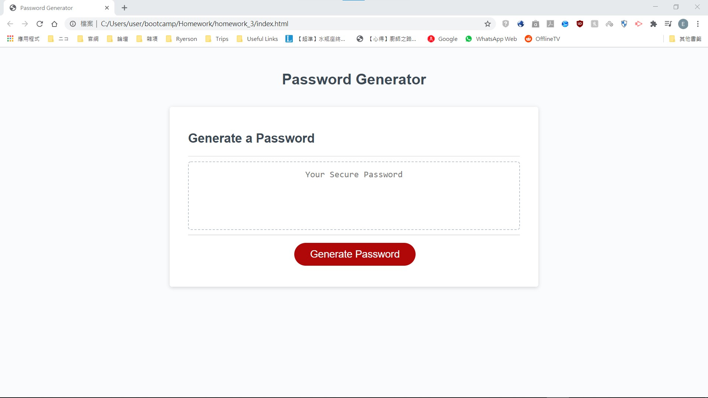
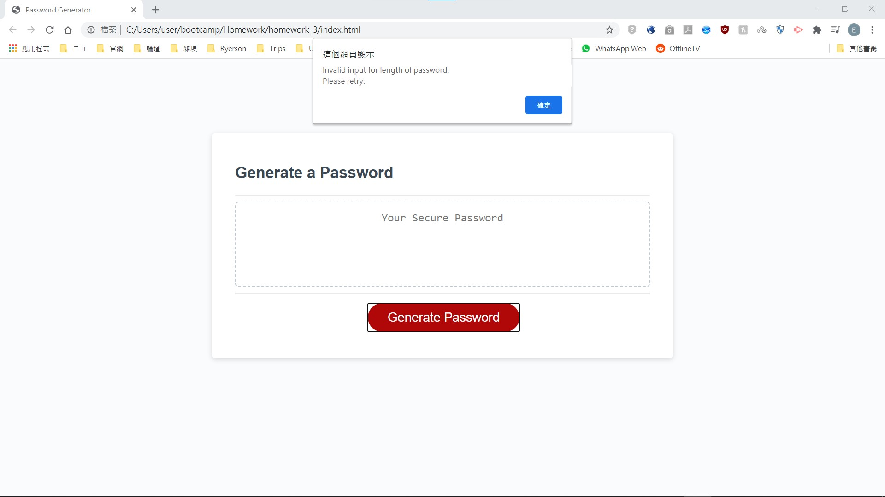
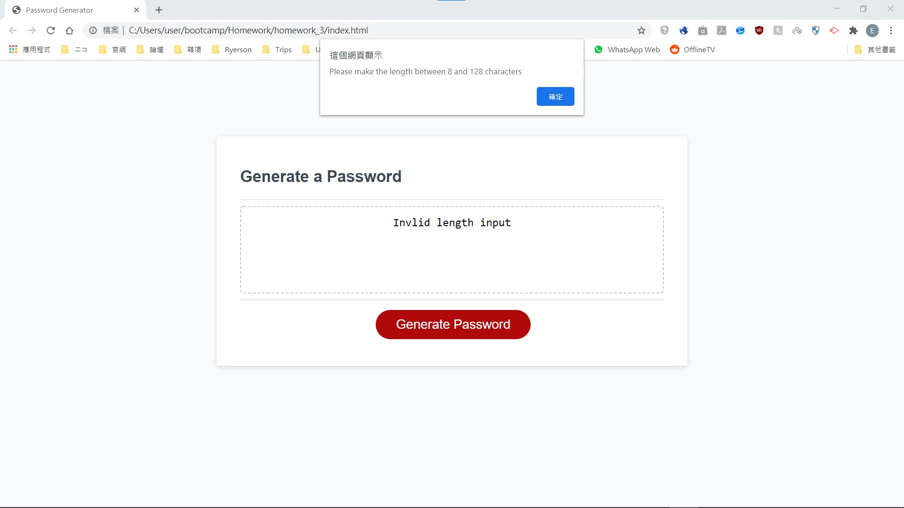
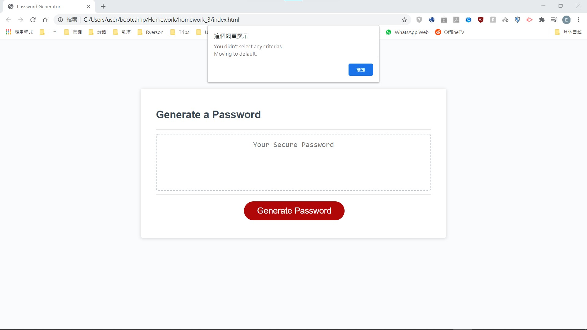

# Password-Generator
Goal: To make a password generator in javascript with the following abilities:
- Length of password can be defined by user between **8 to 128 characters**
- Prompt the user if **special characters**, **numeric characters**, **uppercase** and/or **lowercase characters** need to be included through **confirm messages**
- Generate an **unique** password with the criterias selected and print to the screen
- Able to validate user input for password's length and criteria selection; Output an **alert message** when input is invalid or no criteria is selected

 

This generator contains the following:
- index.html: The front page of the password generator written in **HTML 5** and **Bootstrap**
- script.js: The brain behind the generator
- style.css: Styling for the page and contains **Media Queries** for window size of 690px/500px

# index.html

 

## When input for password length is invalid

 

## When no criterias were selected

